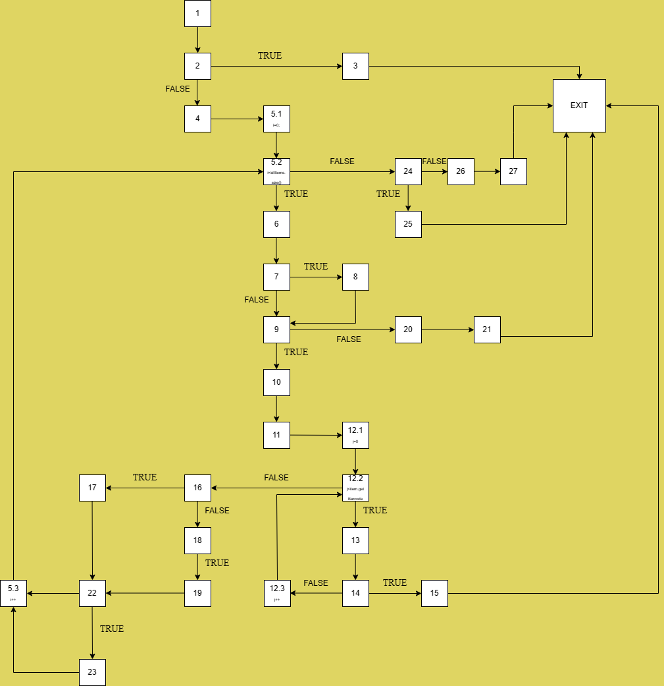
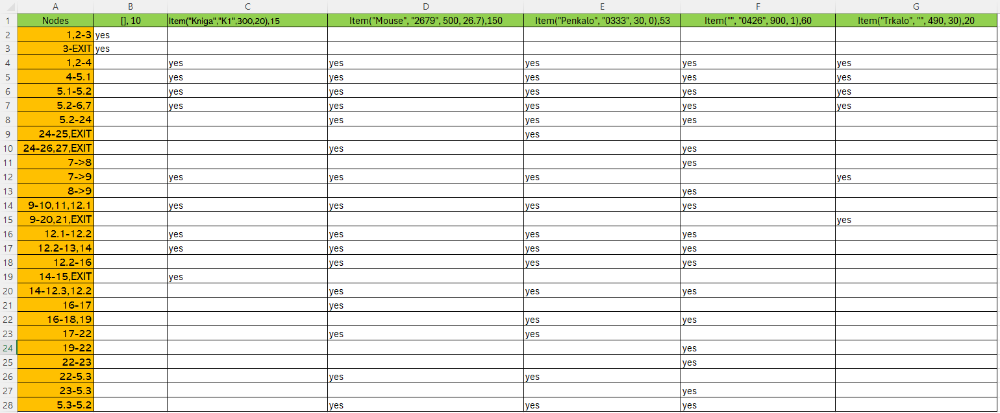

Elena_Aleksovska_213136

1.Control Flow Graph

2.Цикломатската комплексност

Формула: P+1 -> 9+1 = 10
P=9 -> предикатни јазли
Вкупно 10 региони
Цикломатската комплексност на кодот изнесува 10.

3.Every Branch

